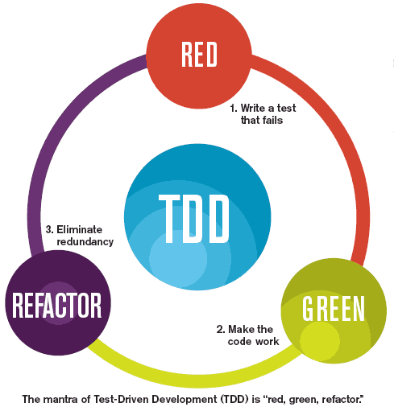

## 테스트 코드

**TDD**

- 테스트가 주도하는 개발
- 테스트 코드를 먼저 작성하는 것으로부터 시작

<div style="text-align: center;">



Red :항상 실패하는 테스트를 먼저 작성하고 <br>
Green : 테스트가 통과하는 프로덕션 코드를 작성하고 <br>
Refactor : 테스트가 통과하면 프로덕션 코드를 리팩토링합니다
</div>

**단위 테스트(Unit Test)**

- TDD의 첫 번째 단계인 기능 단위의 테스트 코드를 작성하는 것
- TDD와 달리 테스트 코드를 꼬 먼저 작성해야하는것도 아니고, 리팩토링도 포함되지 않아 **순수하게 테스트 코드만 작성하는 것**을 말한다.
- 단위 테스트 코드를 작성함으로써 얻는 이점
    - 단위 테스트는 개발단계 초기에 문제를 발견하게 도와준다.
    - 단위 테스트는 개발자가 나중에 코드를 리팩토링하거나 라이브러리 업그레이드 등에서 기존 기능이 올바르게 작동하는지 확인할 수 있다. (ex. 회귀테스트)
    - 단위 테스트는 기능에 대한 불확실성을 감소시킬 수 있다.
    - 단위 테스트는 시스템에 대한 실제 문서를 제공한다. 즉, 단위 테스트 자체가 문서로 사용될 수 있다.

**테스트 코드를 작성하지 않는다면?** <br>
&nbsp;코드가 정상적으로 동작하는지 확인하기 위해서 요청결과를 **`System.out.println()`을 통해 눈으로 검증**해야 하고, 코드를 수정하기 위해서 **톰캣을 내렸다가 다시 실행하는 것을 반복**
해야한다.<br>
&nbsp;&nbsp; → 테스트 코드를 작성한다면 더이상 불필요한 시간을 허비하지 않으며 눈으로 검증하지 않게 **자동검증**이 가능하다. 또한 새로운 기능이 추가될 때 **기존 기능을 안전하게 보호**해준다.

## 테스트 코드 작성하기

### 메인 클래스

```java
package com.chochozabe.springboot;

import org.springframework.boot.SpringApplication;
import org.springframework.boot.autoconfigure.SpringBootApplication;

@SpringBootApplication
public class Application {
    public static void main(String[] args) {
        SpringApplication.run(Application.class, args);
    }
}
```

- `@SpringBootApplication`
    - 스프링부트의 자동 설정, 스프링 Bean 읽기와 생성을 모두 자동으로 설정하는 어노테이션
    - 특히, **이 어노테이션이 있는 위치부터 설정을 읽어**가기 때문에 이 클래스는 **항상 프로젝트의 최상단에 위치**해야한다.


- `SpringApplication.run()`
    - **내장 WAS**을 실행 : 별도로 외부에 WAS을 두지 않고 애플리케이션을 실행할 때 내부에서 WAS을 실행하는 것
        - 별도로 외부에 WAS을 두지 않고 애플리케이션을 실행할 때 내부에서 WAS을 실행하는 것
        - 서버에 톰캣을 설치할 필요가 없게 되고, 스프링 부트로 만들어진 Jar 파일로 실행하면 된다.
        - '**언제 어디서나 같은 환경에서 스프링 부트를 배포**'할 수 있기때문에 스프링부트에선 내장 WAS을 권장한다.

### 테스트 코드

```java
package com.chochozabe.springboot;

import com.chochozabe.springboot.web.HelloController;
import org.junit.jupiter.api.Test;
import org.junit.jupiter.api.extension.ExtendWith;
import org.springframework.beans.factory.annotation.Autowired;
import org.springframework.boot.test.autoconfigure.web.servlet.WebMvcTest;
import org.springframework.test.context.junit.jupiter.SpringExtension;
import org.springframework.test.web.servlet.MockMvc;

import static org.springframework.test.web.servlet.request.MockMvcRequestBuilders.get;
import static org.springframework.test.web.servlet.result.MockMvcResultMatchers.*;

@ExtendWith(SpringExtension.class)
@WebMvcTest(controllers = HelloController.class)
public class HelloControllerTest {

    @Autowired
    private MockMvc mvc;

    @Test
    public void hello가_리턴된다() throws Exception {
        String hello = "Hello";

        mvc.perform(get("/hello"))
                .andExpect(status().isOk())
                .andExpect(content().string(hello));
    }

    @Test
    public void helloDTO가_리턴된다() throws Exception {
        String name = "Hello";
        int amount = 1000;

        mvc.perform(get("/hello/dto")
                        .param("name", name)
                        .param("amount", String.valueOf(amount)))
                .andExpect(status().isOk())
                .andExpect(jsonPath("$.name").value(name))
                .andExpect(jsonPath("$.amount").value(amount));
    }
}
```

- `@ExtendWith(SpringExtension.class)`
    - 테스트를 진행할 때 JUnit에 내장된 실행자 외에 다른 실행자를 실행
    - 여기서는 SpringExtension이라는 스프링 실행자를 실행시킨다 (JUnit5 기준)
    - 즉, 스프링 부트 테스트와 JUnit 사이에 연결자 역할을 한다


- `@WebMvcTest`
    - 여러 스프링 테스트 어노테이션 중, Web(Spring MVC)에 집중할 수 있는 어노테이션
    - 선언 시 `@Controller`, `@ControllerAdvice` 등을 사용할 수 있다.
    - 단, `@Service`, `@Component`, `@Repository` 등은 사용할 수 없다.


- `@Autowired`
    - 스프링이 관리하는 Bean을 주입 받는다.


- `private MockMvc mvc;`
    - 웹 API를 테스트할 때 사용
    - 스프링 MVC 테스트의 시작점
    - 이 클래스를 통해 HTTP GET, POST 등에 대한 API 테스트를 할 수 있다.


- `mvc.perform(get([url]))`
    - MockMvc를 통해 url 주소로 HTTP GET 요청
    - 체이닝이 지원되어 여러 검증 기능을 이어서 선언할 수 있다.
    - `.param` : API 테스트 할 때 사용될 요청 파라미터 설정, String 값만 허용되므로 숫자/날짜 데이터도 문자열로 변경해서 사용


- `.andExpect(...)`
    - mvc.perform의 결과를 검증
    - `status().isOK()` : HTTP Header의 상태를 검증, isOK 이므로 여기서는 200인지 아닌지 검증
    - `content().string(hello)` : 본문 내용을 검증
    - `jsonPath` : JSON 응답값을 필드별로 검증할 수 있는 메소드, $를 기준으로 필드명을 명시
  > Junit5 jsonPath 비교
  > * 버전 4 : jsonPath("$.name", is(name)) <br>
  > * 버전 5 : jsonPath("$.name").value(name)
  >   
  > 참고 : https://ykh6242.tistory.com/100  


> Test 진행시 아래와 같은 로그가 찍혔을 때
> ```
> org.junit.platform.launcher.core.EngineDiscoveryOrchestrator lambda$logTestDescriptorExclusionReasons$7
> 정보: 0 containers and 1 tests were Method or class mismatch
> ```
> **Settings -> Build, Execution, Deployment -> Build Tools -> Gradle** 에서 <br>
> **Build and run using과 Run tests using**의 속성을 **Intellij IDEA**로 변경
>
> 참고 : https://www.inflearn.com/questions/157200
## lombok 설치하기

**lombok**

- 자바 개발할 떄 자주 사용하는 코드 Getter, Setter, Constructor, toString 등을 자동생성해주는 어노테이션

build.gradle에 의존성 추가
```
implementation('org.projectlombok:lombok')
annotationProcessor('org.projectlombok:lombok')
testImplementation('org.projectlombok:lombok')
testAnnotationProcessor('org.projectlombok:lombok')
```
추가 후 Reload All Gradle Projects로 라이브러리를 다운받는다. <br>
그 후 Intellij Marketplace에서 lombok 플러그인을 깔아주면 lombok 설치 완료

> lombok 플러그인을 깔아야하는 이유
> * IntelliJ 코드 분석 엔진은 javac를 사용하지 않고 어노테이션을 실행할 수 없기 때문에 Lombok을 인식시켜주는 과정이 필요하다. 그 역할을 Lombok 플러그인이 해준다.
>
> 참고 : https://dgahn.tistory.com/13

## 기존 코드를 lombok으로 전환하기
```java
package com.chochozabe.springboot.dto;

import lombok.Getter;
import lombok.RequiredArgsConstructor;

@Getter
@RequiredArgsConstructor
public class HelloResponseDTO {

    private final String name;
    private final int amount;

}
```
- `@Getter`
  - 선언된 모든 필드의 get 메소드를 생성


- `@RequiredArgsConstructor`
  - 선언된 모든 final 필드가 포함된 생성자를 생성
  - final이 없는 필드는 생성자에 포함되지 않는다.

```java
// lombok 작동 테스트
package com.chochozabe.springboot.dto;

import org.junit.jupiter.api.Test;

import static org.assertj.core.api.Assertions.assertThat;

public class HelloResponseDTOTest {

  @Test
  public void 롬복_기능_테스트() {
    // given
    String name = "test";
    int amount = 1000;

    // when
    HelloResponseDTO dto = new HelloResponseDTO(name, amount);

    // then
    assertThat(dto.getName()).isEqualTo(name);
    assertThat(dto.getAmount()).isEqualTo(amount);
  }

}
```
- `assertThat`
  - assertj라는 테스트 검증 라이브러리의 검증 메소드
  - 검증하고 싶은 대상을 메소드 인자로 받는다
  - 메소드체이닝이 지원되어 isEqualTo와 같이 메소드를 이어서 사용할 수 있다.


- `isEqualTo`
  - assertj의 동등 비교 메소드
  - assertThat에 있는 값과 isEqualTo의 값을 비교해서 같을 때만 성공

> assertj의 장점
> * 추가적으로 라이브러리가 필요하지 않다. <br>
> * 자동완성이 더 확실하게 지원된다.  
> 
> 참고 : https://www.youtube.com/watch?v=zLx_fI24UXM
