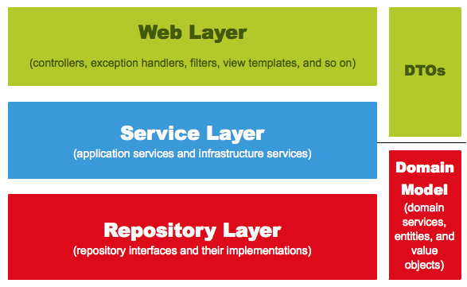

### 등록/수정/조회 API 만들기

**Spring 웹 계층구조**

- API를 만들기 위해선 3개의 클래스가 필요
    - Request 데이터를 받을 DTO
    - API 요청을 받을 Controller
    - 트랜잭션, 도메인 기능 간의 순서를 보장하는 Service
- Service에서 비지니스 로직을 처리하는 것이 아닌 **트랜잭션, 도메인 간 순서 보장의 역할**만 함
- Spring 웹 계층

  

  - Web Layer
    - 흔히 사용하는 컨트롤러, JSP / Freemarker 등의 뷰 템플릿 영역
    - 이외에도 필터, 인터셉터, 컨트롤러 어드바이스 등 외부 요청과 응답에 대한 전반적인 영역
  - Service Layer
    - `@Service`에 사용되는 서비스 영역
    - 일반적으로 Controller와 Dao의 중간 영역에서 사용
    - `@Transactional`이 사용되어야 하는 영역
  - Repository Layer
    - Database와 같이 데이터 저장소에 접근하는 영역
    - Dao 개념으로 이해하면 쉽다
  - DTOs
    - DTO(Data Transfer Object)는 **계층 간에 데이터 교환을 위한 객체**, DTOs는 이들의 영역
    - 뷰 템플릿 엔진에서사용될 객체나 Repository Layer에서 결과로 넘겨준 객체 등을 예로 들 수 있다
  - Domain Model
    - 도메인이라 불리는 개발 대상을 모든 사람들이 동일한 관점에서 이해할 수 있고 공유할 수 있도록 단순화시킨 것
    - 택시 앱을 예로 들면 배차, 탑승, 요금 등이 모두 도메인이 될 수 있음
    - `@Entity`가 사용된 영역도 도메인 모델
    - VO같은 값 객체들도 이 영역에 해당되기 때문에, **무조건 데이터베이스의 테이블과 관계가 있어야만 하는 것은 아님**
  - " 이 다섯가지 레이어 중에 비즈니스를 담당해야하는 곳은 **Domain** "
- 기존의 서비스 처리 방식 : **트랜잭션 스크립트**
  - 슈도 코드
  ```java
  @Transcational
  public Order cancleOrder(int orderId) {
      1) 데이터베이스로부터 주문정보 (Orders), 결제정보 (Billing), 배송정보(Delivery) 조회
          
      2) 배송 취소를 해야 하는지 확인
      
      3) if(배송중이라면) {
        배송 취소로 변경
      }
      
      4) 각 테이블에 취소 상태 Update
  }
  ```
  - 실제 코드
  ```java
  @Transcational
  public Order cancleOrder(int orderId) {
      // 1) 
      OrderDTO order = ordersDao.selectOrders(orderId);
      BillingDTO billing = billingDao.selectBilling(orderId);   
      DeliveryDTO delivery = deliveryDao.selectDelivery(orderId);
  
      // 2) 
      String deliveryStatus = delivery.getStatus();
  
      // 3)
      if("IN_PROGRESS".equals(deliveryStatus)) {
        delivery.setStatus("CANCLE");
        deliveryDao.update(delivery);
      }
      
      // 4) 
      order.setStatus("CANCLE");
      ordersDao.update(order);
  
      billing.setStatus("CANCLE");
      deliveryDao.update(billing);
  
      return order;
  }
  ```
  - 모든 로직이 서비스 클래스 내부에서 처리
  - **서비스 계층이 무의미하며, 객체란 단순히 데이터 덩어리** 역할만 하게 됨
- 도메인 모델에서 처리할 경우
  ```java
  @Transcational
  public Order cancleOrder(int orderId) {
      // 1) 
      Orders order = ordersRepository.findById(orderId);
      Billing billing = billingRepository.findByOrderId(orderId);
      Delivery delivery = deliveryRepository.findByOrderId(orderId);
  
      // 2 - 3)
      delivery.cancle();
      
      // 4) 
      order.cancle();
      billing.cancle();
  
      return order;
  }
  ```
    - order, billing, delivery 각자 본인의 취소 이벤트 처리
    - 서비스 메소드는 **트랜잭션과 도메인 간의 순서만 보장**

<br>

**등록 API**
- PostsApiController
```java
package com.chochozabe.springboot.web;

import com.chochozabe.springboot.service.PostsService;
import lombok.RequiredArgsConstructor;
import org.springframework.web.bind.annotation.PostMapping;
import org.springframework.web.bind.annotation.RequestBody;
import org.springframework.web.bind.annotation.RestController;

@RequiredArgsConstructor
@RestController
public class PostsApiController {

  private final PostsService postsService;

  @PostMapping("/api/v1/posts")
  public Long save(@RequestBody PostsSaveRequestDTO requestDTO) {
    return postsService.save(requestDTO);
  }
  
}
```
- PostService
```java
package com.chochozabe.springboot.service;

import com.chochozabe.springboot.domain.posts.PostsRepository;
import com.chochozabe.springboot.dto.PostsSaveRequestDTO;
import lombok.RequiredArgsConstructor;
import org.springframework.stereotype.Service;

@RequiredArgsConstructor
@Service
public class PostsService {
    private final PostsRepository postsRepository;

    public Long save(PostsSaveRequestDTO requestDTO) {
        return postsRepository.save(requestDTO.toEntity()).getId();
    }
    
}
```
  - Spring에서 Bean을 주입받는 방식
    - `@Autowired` `setter` `생성자`
    - 이 중 **생성자로 주입**받는 방식을 가장 권장 (@Autowired 비권장) 
    - 생성자로 Bean 객체를 받도록하면 @Autowired와 동일한 효과 
    - 현재 소스에서는 lombok의 **@RequiredArgsConstructor**에서 **final이 선언된 모든 필드**를 인자값으로 하는 생성자 생성 <br>

    > 생성자를 직접 쓰지않고 lombok을 사용하는 이유
    > 
    > 해당 클래스의 의존성 관계가 변경될 떄마다 생성자 코드를 계속해서 수정하는 번거로움을 해결 <br>
    > 해당 컨트롤러에 새로운 서비스를 추가하거나, 기존 컴포넌트를 제거하는 등의 상황이 발생해도 생성자 코드는 손댈 필요가 없다.
  
  - PostsSaveRequestDTO
    - Entity 클래스와 유사한 형태지만 절대 **Entity 클래스를 Request/Response 클래스로 사용해서는 안됨**
    - Entity 클래스는 **데이터베이스와 맞닿아져있는 핵심 클래스**이기에 화면 출력값같은 사소한 기능 변경을 위해 이를 변경할 순 없음
    - **컨트롤러에서 결과값으로 여러 테이블을 조인해서 줘야할 경우가 빈번**하므로 View Layer와 DB Layer의 역할 분리를 철저하게 하는게 좋다.
```java
package com.chochozabe.springboot.dto;

import com.chochozabe.springboot.domain.posts.Posts;
import lombok.Builder;
import lombok.Getter;
import lombok.NoArgsConstructor;

@Getter
@NoArgsConstructor
public class PostsSaveRequestDTO {
    private String title;
    private String content;
    private String author;

    @Builder
    public PostsSaveRequestDTO(String title, String content, String author) {
        this.title = title;
        this.content = content;
        this.author = author;
    }

    public Posts toEntity() {
        return Posts.builder()
                .title(title)
                .content(content)
                .author(author)
                .build();
    }
}
```

  - PostApiControllerTest
    - `@WebMvcTest`의 경우 JPA 기능이 동작하기 않고 Controller와 ControllerAdvice 등 외부 연동과 관련된 부분만 활성화
    - JPA 기능까지 한번에 테스트할 때는 `@SpringBootTest`와 `TestRestTemplate`를 사용
```java
package com.chochozabe.springboot.dto;

import com.chochozabe.springboot.domain.posts.Posts;
import com.chochozabe.springboot.domain.posts.PostsRepository;
import org.junit.jupiter.api.AfterEach;
import org.junit.jupiter.api.Test;
import org.junit.jupiter.api.extension.ExtendWith;
import org.springframework.beans.factory.annotation.Autowired;
import org.springframework.boot.test.context.SpringBootTest;
import org.springframework.boot.test.web.client.TestRestTemplate;
import org.springframework.boot.web.server.LocalServerPort;
import org.springframework.http.HttpStatus;
import org.springframework.http.ResponseEntity;
import org.springframework.test.context.junit.jupiter.SpringExtension;

import java.util.List;

import static org.assertj.core.api.Assertions.assertThat;

@ExtendWith(SpringExtension.class)
@SpringBootTest(webEnvironment = SpringBootTest.WebEnvironment.RANDOM_PORT)
public class PostsApiControllerTest {

    @LocalServerPort
    private int port;

    @Autowired
    private TestRestTemplate restTemplate;

    @Autowired
    private PostsRepository postsRepository;

    @AfterEach
    public void tearDown() throws Exception {
        postsRepository.deleteAll();
    }

    @Test
    public void Posts_등록된다() throws Exception {
        // given
        String title = "title";
        String content = "content";

        PostsSaveRequestDTO requestDTO = PostsSaveRequestDTO.builder().title(title).content(content).build();

        String url = "http://localhost:" + port + "/api/v1/posts";

        // when
        ResponseEntity<Long> responseEntity = restTemplate.postForEntity(url, requestDTO, Long.class);

        // then
        assertThat(responseEntity.getStatusCode()).isEqualTo(HttpStatus.OK);
        assertThat(responseEntity.getBody()).isGreaterThan(0L);

        List<Posts> list = postsRepository.findAll();
        assertThat(list.get(0).getTitle()).isEqualTo(title);
        assertThat(list.get(0).getContent()).isEqualTo(content);

    }
    
}
```
