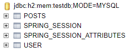

### 어노테이션 기반으로 개선하기

- **같은 코드가 반복**된다면 나쁜 코드
- 앞서 만든 코드에서는 **세션값을 가져오는 부분**이 반복되어 대표적인 나쁜 코드
- 그 부분으로 **메소드 인자로 세션값을 바로 받는** 방법으로 개선


- `@LoginUser`
   ```java
   package com.chochozabe.springboot.config.auth;
   
   import java.lang.annotation.ElementType;
   import java.lang.annotation.Retention;
   import java.lang.annotation.RetentionPolicy;
   import java.lang.annotation.Target;
   
   @Target(ElementType.PARAMETER)
   @Retention(RetentionPolicy.RUNTIME)
   public @interface LoginUser {
   }
   ```
    1. `@Target(ElementType.PARAMETER)`
        - 해당 어노테이션이 생성될 수 있는 위치 지정
        - `PARAMETER` : 메소드의 파라미터로 선언된 객체에서만 사용 가능
    2. `@interface`
        - 어노테이션 클래스로 지정


- `LoginUserArgumentResolver`
   ```java
   package com.chochozabe.springboot.config.auth;
   
   import com.chochozabe.springboot.config.auth.dto.SessionUser;
   import lombok.RequiredArgsConstructor;
   import org.springframework.core.MethodParameter;
   import org.springframework.stereotype.Component;
   import org.springframework.web.bind.support.WebDataBinderFactory;
   import org.springframework.web.context.request.NativeWebRequest;
   import org.springframework.web.method.support.HandlerMethodArgumentResolver;
   import org.springframework.web.method.support.ModelAndViewContainer;
   
   import javax.servlet.http.HttpSession;
   
   @RequiredArgsConstructor
   @Component
   public class LoginUserArgumentResolver implements HandlerMethodArgumentResolver {
   
       private final HttpSession httpSession;
   
       @Override
       public boolean supportsParameter(MethodParameter parameter) {
           boolean isLoginUserAnnotation = parameter.getParameterAnnotation(LoginUser.class) != null;
           boolean isUserClass = SessionUser.class.equals(parameter.getParameterType());
   
           return isLoginUserAnnotation && isUserClass;
       }
   
       @Override
       public Object resolveArgument(MethodParameter parameter, ModelAndViewContainer mavContainer, NativeWebRequest webRequest, WebDataBinderFactory binderFactory) {
           return httpSession.getAttribute("user");
       }
   }
   ```
    1. `supportsParameter(...)`
        - 특정 파라미터를 지원하는지 판단
        - 이 코드에서는 `@LoginUser` 어노테이션이 붙어 있고, 파라미터 클래스 타입이 `SessionUser.class`인 경우 true 반환
    2. `resolveArgument(...)`
        - 파라미터에 전달할 객체 생성
        - 이 코드에서는 세션에서 객체를 가져옴


- `WebConfig`
    - 위에서 생성한 `LoginUserArgumentResolver`가 스프링에서 인식될 수 있도록 추가
    - `HandlerMethodArgumentResolver`는 항상 `WebMvcConfigurer`의 `addArgumentResolvers()` 를 통해 추가
   ```java
   package com.chochozabe.springboot.config;
   
   import com.chochozabe.springboot.config.auth.LoginUserArgumentResolver;
   import lombok.RequiredArgsConstructor;
   import org.springframework.context.annotation.Configuration;
   import org.springframework.web.method.support.HandlerMethodArgumentResolver;
   import org.springframework.web.servlet.config.annotation.WebMvcConfigurer;
   
   import java.util.List;
   
   @RequiredArgsConstructor
   @Configuration
   public class WebConfig implements WebMvcConfigurer {
       private final LoginUserArgumentResolver loginUserArgumentResolver;
   
       @Override
       public void addArgumentResolvers(List<HandlerMethodArgumentResolver> argumentResolvers) {
           argumentResolvers.add(loginUserArgumentResolver);
       }
   }
   ```


- `IndexController`
    - 기존에 `httpSession.getAttribute("user")`로 세션을 가져오던 부분을 `@LoginUser` 어노테이션으로 변경
  ```java
     ...
     @RequiredArgsConstructor
     @Controller
     public class IndexController {
     
         private final PostsService postsService;
     
         @GetMapping("/")
         public String index(Model model, @LoginUser SessionUser user) {
             model.addAttribute("posts", postsService.findAllDesc());
     
             if (user != null) {
                 System.out.println("==================================");
                 System.out.println(user.toString());
                 model.addAttribute("loginName", user.getName());
             }
     
             return "index";
         }
         ...
     }
  ```
- 변경 후 프로젝트를 재시작하여 로그인 기능 확인

<br>

### 세션 저장소로 데이터베이스 사용하기

**현재 프로젝트의 개선할 점**

- **내장 톰캣 메모리에 세션을 저장**하고 있기 때문에 애플리케이션을 재시작할 시 로그인이 풀림
- 2대 이상의 서버에서 서비스할 시 톰캣마다 세션 동기화 설정

<br>

**현업에서 많이 사용하는 세션 저장소**

1. 톰캣 세션 이용
    - 일반적으로 별다른 설정을 하지 않을때 기본적으로 선택
    - 톰캣(WAS)에 세션이 저장되어 2대 이상의 WAS가 구동되는 환경에서는 톰캣들 간의 세선 공유 추가 설정
2. MySQL과 같은 데이터베이스를 세션 저장소로 사용
    - 여러 WAS 간의 공용 세션을 사용할 수 있는 가장 쉬운 방법
    - 많은 설정이 필요없지만, 로그인 요청마다 DB IO가 발생해 성능상 이슈가 발생할 수 있음
    - 로그인 요청이 많이 없는 백오피스, 사내 시스템 용도로 주로 이용
3. Redis, Memcached와 같은 메모리 DB를 세션 저장소로 사용
    - B2C 서비스에서 가장 많이 사용
    - 실제 서비스로 사용하기에는 외부 메모리 서버가 필요

<br>

여기서는 설정이 간단하고 사용자가 많은 서비스가 아니며 비용 절감을 위해 **데이터베이스를 세션 저장소로 사용**

<br>

**`spring-session-jdbc` 등록**

- `build.gradle`
    ```properties
    implementation('org.springframework.session:spring-session-jdbc')
    ```
- `application.properties`
    - 세션 저장소로 jdbc를 지정
  ```properties
  spring.session.store-type=jdbc
  ```
- 서비스 재시작 후 H2 Console 접속하여 **JPA로 인해 세션을 위한 테이블 2개가 자동으로 생성**된 걸 확인

  
- 지금의 프로젝트는 **스프링을 재시작하면 H2도 재시작되기때문에 세션이 풀린다**.
- 후에 AWS의 데이터베이스 서비스로 수정할 예정

<br>

### 네이버 로그인

**네이버 API 등록**

- https://developers.naver.com/products/login/api/api.md
    - 어플리케이션 이름, 제공 정보 선택(회원이름, 이메일, 프로필사진), URL 등록
    - CallBack Url : `http://localhost:8080/login/oauth2/code/naver`
    - 등록 후 생성된 Client Id, Client Secret 키값들을 `application-oauth.properties`에 등록
- `application-oauth.properties`
    - 네이버에서는 스프링 시큐리티를 공식지원하지 않기때문에 Common-OAuth2Provider에서 해준던 값들을 수동으로 입력
      ```properties
          ...
          # registration
          spring.security.oauth2.client.registration.naver.client-id=2u8ylrVrtDykB2khaUXR
          spring.security.oauth2.client.registration.naver.client-secret=ueS_4BffsQ
          spring.security.oauth2.client.registration.naver.redirect-uri={baseUrl}/{action}/oauth2/code/{registrationId}
          spring.security.oauth2.client.registration.naver.authorization-grant-type=authorization_code
          spring.security.oauth2.client.registration.naver.scope=name,email,profile_image
          spring.security.oauth2.client.registration.naver.client-name=Naver
          
          # provider
          spring.security.oauth2.client.provider.naver.authorization-uri=https://nid.naver.com/oauth2.0/authorize
          spring.security.oauth2.client.provider.naver.token-uri=https://nid.naver.com/oauth2.0/token
          spring.security.oauth2.client.provider.naver.user-info-uri=https://openapi.naver.com/v1/nid/me
          spring.security.oauth2.client.provider.naver.user-name-attribute=response
      ```

<br>

**스프링 시큐리티 설정 등록**

- `OAuthAttributes`
  - 네이버인지 구글인지 판단하는 코드와 네이버 생성자 추가
  
  ```java
        ...
        @Getter
        public class OAuthAttributes {
            ...
              
            public static OAuthAttributes of(String registrationId, String userNameAttributeName, Map<String, Object> attributes) {
                System.out.println("==========================");
                System.out.println(registrationId);
                System.out.println("==========================");
                if("naver".equals(registrationId)) {
                    return ofNaver("id", attributes);
                }
                return ofGoogle(userNameAttributeName, attributes);
            }
              
            ...
              
            public static OAuthAttributes ofNaver(String userNameAttributeName, Map<String, Object> attributes) {
                Map<String, Object> response = (Map<String, Object>) attributes.get("response");
              
                return OAuthAttributes.builder()
                        .name((String) response.get("name"))
                        .email((String) response.get("email"))
                        .picture((String) response.get("profile_image"))
                        .attributes(response)
                        .nameAttributeKey(userNameAttributeName)
                        .build();
            }
              
            ...
        }
      ```
    
- `index.mustache`

    ```html
    ...
    {{^loginName}}
    <a href="/oauth2/authorization/google" class="btn btn-success active" role="button">Google Login</a>
    <a href="/oauth2/authorization/naver" class="btn btn-secondary active" role="button">Naver Login</a>
    {{/loginName}}
    ...
    ```

<br>

### 기존 테스트에 시큐리티 적용하기

1. `CustomOAuth2UserService을 찾을 수 없음`
    - main의 application.properties의 설정만 가져오기 때문에 테스트용 oauth 설정을 따로 해줘야한다
    - `src/test/resources/application.properties`
       ```properties
       ...
    
       # Test OAuth
       spring.security.oauth2.client.registration.google.client-id=test
       spring.security.oauth2.client.registration.google.client-secret=test
       spring.security.oauth2.client.registration.google.scope=profile,email
       ```

2. `302 Status code`
    - `build.gradle`
       ```properties
       ...
       testImplementation("org.springframework.security:spring-security-test")
       ...
       ```
    - `PostApiControllerTest`
    ```java
    package com.chochozabe.springboot.web;
    
    import org.springframework.http.MediaType;
    import org.springframework.security.test.context.support.WithMockUser;
    import org.springframework.test.context.junit.jupiter.SpringExtension;
    import org.springframework.test.web.servlet.MockMvc;
    import org.springframework.test.web.servlet.setup.MockMvcBuilders;
    import org.springframework.web.context.WebApplicationContext;
    
    import java.util.List;
    
    import static org.springframework.security.test.web.servlet.setup.SecurityMockMvcConfigurers.springSecurity;
    import static org.springframework.test.web.servlet.result.MockMvcResultMatchers.status;
    
    @ExtendWith(SpringExtension.class)
    @SpringBootTest(webEnvironment = SpringBootTest.WebEnvironment.RANDOM_PORT)
    public class PostsApiControllerTest {
    ...
    
        @Autowired
        private WebApplicationContext context;
    
        private MockMvc mvc;
    
        @BeforeEach
        public void setup() {
            mvc = MockMvcBuilders.webAppContextSetup(context)
                    .apply(springSecurity())
                    .build();
        }
          
          ...
    
        @Test
        @WithMockUser(roles = "USER")
        public void Posts_등록된다() throws Exception {
            ...
            // when
            mvc.perform(post(url)
                            .contentType(MediaType.APPLICATION_JSON)
                            .content(new ObjectMapper().writeValueAsString(requestDTO)))
                    .andExpect(status().isOk());
    
            // then
            List<Posts> list = postsRepository.findAll();
            assertThat(list.get(0).getTitle()).isEqualTo(title);
            assertThat(list.get(0).getContent()).isEqualTo(content);
        }
    
        @Test
        @WithMockUser(roles = "USER")
        public void Posts_수정된다() throws Exception {
            ...
    
            // when
            mvc.perform(put(url)
                            .contentType(MediaType.APPLICATION_JSON)
                            .content(new ObjectMapper().writeValueAsString(requestDTO)))
                    .andExpect(status().isOk());
    
            // then
            List<Posts> list = postsRepository.findAll();
            assertThat(list.get(0).getTitle()).isEqualTo(expectedTitle);
            assertThat(list.get(0).getContent()).isEqualTo(expectedContent);
        }
    }  
    ```
   1. `@WithMockUser(roles = "USER")`
       - 인증된 가짜 사용자 사용
       - roles의 권한 추가
   2. `@BeforeEach`
      - 매번 테스트가 시작되기 전에 MockMvc 인스턴스 생성
   3. `mvc.perform`
      - 생성된 MockMvc를 통해 API 테스트
3. `@WebMvcTest에서 CustomOAuth2UserService을 찾을 수 없음`
   - `HelloControllerTest`
    ```java
    ...
    
    @ExtendWith(SpringExtension.class)
    @WebMvcTest(
            controllers = HelloController.class,
            excludeFilters = {
                    @ComponentScan.Filter(type = FilterType.ASSIGNABLE_TYPE, classes = SecurityConfig.class)
            })
    public class HelloControllerTest {
        ...
    
        @Test
        @WithMockUser(roles = "USER")
        public void hello가_리턴된다() throws Exception {
            ...
        }
    
        @Test
        @WithMockUser(roles = "USER")
        public void helloDTO가_리턴된다() throws Exception {
            ...
        }
    }
    ```
    - `Application.java`
    ```java
    // @EnableJpaAuditing 삭제
    @SpringBootApplication
    public class Application {
        public static void main(String[] args) {
            SpringApplication.run(Application.class, args);
        }
    }
    ```
   - `JpaConfig.java`
    ```java
    package com.chochozabe.springboot.config;
    
    import org.springframework.context.annotation.Configuration;
    import org.springframework.data.jpa.repository.config.EnableJpaAuditing;
    
    @Configuration
    @EnableJpaAuditing
    public class JpaConfig {
    }
    ```