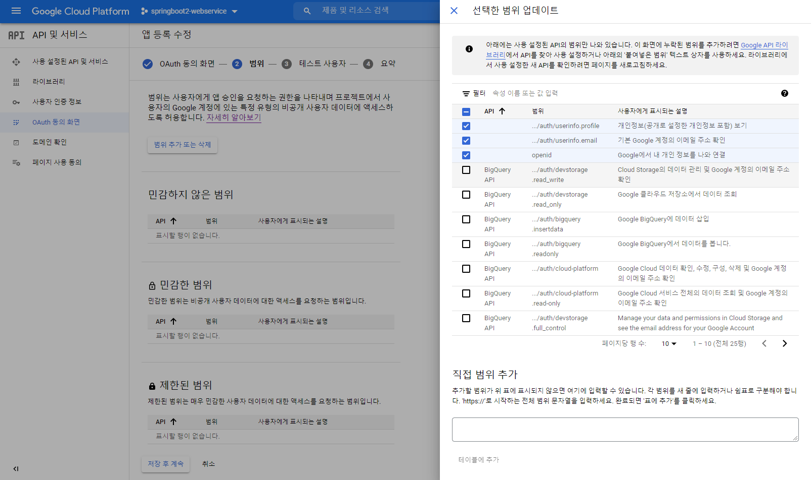

**스프링 시큐리티**

- 막강한 인증과 권한 부여(인가) 기능을 가진 프레임워크
- 사실상 스프링 기반의 애플리케이션에서는 보안을 위한 표준이라고 볼 수 있음
- 인터셉터, 필터 기반의 보안 기능을 구현하는 것보다 스프링 시큐리티를 통해 구현하는 것을 적극적으로 권장
- 확장성을 고려한 프레임워크다 보니 다양한 요구사항을 손쉽게 추가하고 변경할 수 있음
    - 특히, 스프링 부트 1.5에서 2.0으로 넘어오면서 더욱 더 강력해짐

<br>

### 스프링 시큐리티와 스프링 시큐리티 OAuth2 클라이언트

---

많은 서비스에서 로그인 기능을 id/pw 방식보다 구글, 페이스북, 네이버 같은 소셜 로그인 기능을 사용한다 <br>
왜냐? 직접 구현할 경우 배보다 배꼽이 커지는 경우가 많기 때문

직접 구현해야하는 것 (OAuth를 써도 직접 구현해야하는 것 제외) |
--- | 
로그인 시 보안 |
회원가입 시 이메일 혹은 전화번호 인증 |
비밀번호 찾기 |
비밀번호 변경 |
회원정보 변경  |

OAuth 로그인 구현 시 이 목록의 것들을 모두 구글, 페이스북, 네이버 등에 맡기고 서비스 개발에 집중 할 수 있음

- 스프링부트 1.5 vs 스프링 부트 2.0 스프링 부트 1.5에서의 Oauth2 연동 방법이 크게 변경되었지만 라이브러리 덕분에 설정 방법은 크게 차이가 없다 <br>

```properties
spring-security-oauth2-autoconfigure
```

이 라이브러리를 사용할 경우 스프링부트 2에서도 1.5에서 쓰던 설정을 그대로 사용할 수 있다. <br>
기존에 안전하게 작동하던 코드를 사용하는 것이 더 확실하기에 많은 개발자들이 이 방식을 사용해왔다 <br>
하지만 여기서는 아래의 이유로 스프링 부트 2 방식인 Spring Security Oauth2 Clinent 라이브러리를 사용해서 설정

- 스프링 팀에서 기존에 1.5에서 사용되던 spring-security-oauth2-autoconfigure 프로젝트는 유지상태로 결정했으면 더이상의 신규 기능은 추가하기 않고 버그 수정 정도의 기능만 추가될
  예정, 신규 기능은 새 oauth2 라이브러리에서만 지원
- 스프링 부트용 라이브러리 출시(starter)
- 기존에 사용되던 방식을 확장 포임트가 적절하게 오픈되어 있지않아 직접 상속하거나 오버라이딩 해야 하고 신규 라이브러리의 경우 확장 포인트를 고려해서 설계된 상태

> 스프링 부트 2 방식의 자료를 찾고 싶은 경우 확인해볼 것
>
> 1. spring-security-oauth2-autoconfigure 라이브러리를 썻는지 확인 <br>
> 2. application.properties 혹은 application.yml 정보가 다음과 차이가 있는지 확인 
>   - 스프링 부트 1.5 : url 주소 명시
>    - 스프링 부트 2.0 : client 인증 정보만 입력
> 
> 1.5버전에서 직정 입력했던 값들은 2.0에서 모두 enum으로 대체 <br>
> **CommonOAuth2Provider** 라는 enum이 새롭게 추가되어 구글, 깃허브, 페이스북, 옥타의 기본 설정값 제공 <br>
> 이 외의 소셜 로그인은 직접 추가해주면 된다

 <br>

### 구글 서비스 등록

---

**구글 서비스에 신규 서비스 생성**

- 발급된 인증 정보로 로그인 기능과 소셜 서비스 기능 사용 가능

1. [https://console.cloud.google.com/](https://console.cloud.google.com/) 로 이동


2. `[프로젝트 선택]` 탭 클릭하여 페이지 이동 후 `[새 프로젝트]` 클릭


3. 등록될 서비스 이름 입력

   


4. 생성이 완료된 프로젝트를 선택하여 `[API 및 서비스]` 카테고리의 `[사용자 인증 정보]를` 클릭하고 `[사용자 인증 정보 만들기]`에서 `[OAuth 클라이언트 ID]` 클릭

    - 사용자 인증 정보에는 여러 메뉴가 있는데 소셜 로그인은 OAuth 클라이언트 ID로 구현

   


5. `[동의 화면 구성]` 클릭

   


6. 조직 내 사용이 아니기 때문에 `[외부]` 선택

   


7. 앱 이름 / 지원 이메일 입력

   


8. Google API 범위 선택

    - 기본값은 email / profile / openid

   


9. `[OAuth 클라이언트 ID]` 만들기에서 프로젝트 이름 / URL 등록

    - 승인된 리디렉션 URL

        - 서비스에서 파라미터로 인증 정보를 주었을 때 인증이 성공하면 구글에서 리디렉션할 URL

        - 스프링 부트 2 버전의 시큐리티에서는 기본값 : `{도메인}/login/oauth2/code/{소셜서비스코드}`

   

<br>

**프로젝트 내 설정**

- `application-oauth.properties` 등록
    - `application.properties`가 있는 디렉토리에 `application-oauth.properties` 생성
    - 다음과 같이 클라이언트 ID와 클라이언트 보안 비밀코드 등록
    ```properties
    spring.security.oauth2.client.registration.google.client-id={클라이언트 ID}
    spring.security.oauth2.client.registration.google.client-secret={클라이언트 보안 비밀코드}
    spring.security.oauth2.client.registration.google.scope=profile,email
    ```
  > scope=profile,email
  >
  > 기본값이 profile, email, openid이기 때문에 많은 예제에서 별도로 등록하지않지만 openid라는 scope가 있을 시 Open Id Provider로 인식하여 <br>
  OpenId Provider인 서비스와 그렇지 않은 서비스로 각각 나눠서 OAuth2Service를 만들어야하기 때문에 scope에서 openid를 미지정
    - 스프링부트에서는 application-xxx.properties로 properties를 생성하면 xxx라는 이름의 profile이 생성되어 이를 통해 관리할 수 있다
    - 즉, profile=xxx로 호출하면 해당 properties의 설정을 가져올 수 있다는 뜻으로 `application.properties`에 oauth 설정 추가
      ```properties
      ...
      spring.profiles.include=ouath
      ...
      ```


- `.gitignore` 등록
  - 구글 로그인을 위한 클라이언트 ID와 클라이언트 보안 비밀코드는 보안이 중요한 정보이기에 외부에 노출된 경우 개인정보의 보안이 취약해질 수 있다
  - 보안을 위해 `application-oauth.properties`를 깃허브에 올라가지 못하도록 `.gitignore`에 추가
    ```gitignore
    application-oauth.properties
    ```
  - `.gitignore`를 커밋한 후 커밋 파일 목록에 `application-oauth.properties`가 뜨지않으면 성공

[comment]: <> (> 이름이 계정 이름이 아닌 OS 사용자 이름으로 뜨는 경우)

[comment]: <> (>)

[comment]: <> (> - IndexController의 addmodel.addAttribute&#40;"userName", user.getName&#40;&#41;&#41;; 부분에서 "userName"을 "userNames"로 바꿨다. &#40;index.mustache도 따라서 userName -> userNames로&#41;)

[comment]: <> (> )

[comment]: <> (> userName이라는 이름을 스프링 부트나. 다른 곳에서 사용하고 있기 때문에 충돌난 것이 아닌가 싶다. db에는 변경 없이도 문제 없이 저장된다.)