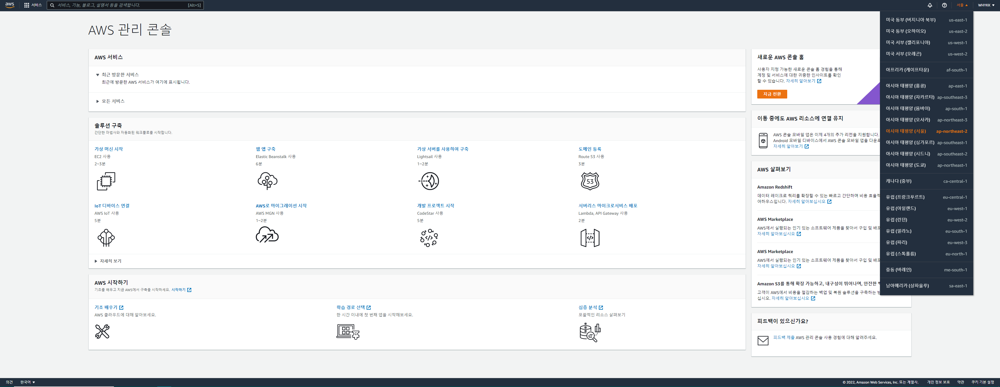
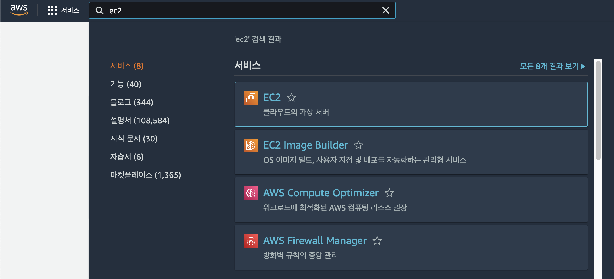
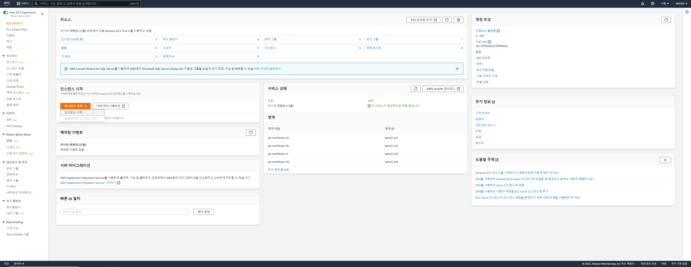
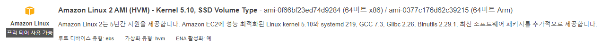
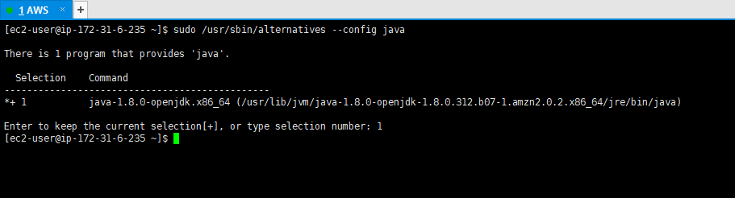
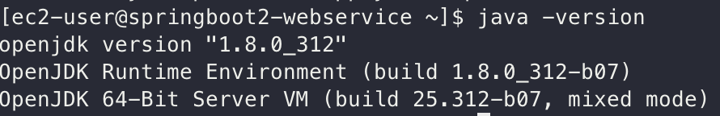
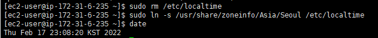

### AWS 서버 환경을 만들어보자 - AWS EC2

**클라우드 서비스**

- 인터넷을 통해 서버, 스토리지, 데이터베이스, 네트워크, 소프트웨어, 모니터링 등의 컴퓨팅 서비스를 제공
- 외부에서 본인이 만든 서비스에 접근하려면 **24시간 작동하는 서버** 필요
    1. 집에 PC를 24시간 구동
    2. 호스팅 서비스 이용
    3. 클라우드 서비스 이용

    - 특정 시간에만 트래픽이 몰린다면(24시간 중 특정 시간에만 트래픽이 올라간다는 것 X, 전반적으로 일정한 트래픽이 유지)
      **유동적으로 사양을 늘릴 수 있는 클라우드가 유리**
- 클라우드의 형태
    1. Infrastructure as a Service (IaaS)
        - 기존 물리 장비를 미들웨어와 함께 묶어둔 추상화 서비스
        - 가상머신, 스토리지, 네트웤, 운영체제 등의 IT 인프라를 대여해주는 서비스
        - AWS의 EC2, S3
    2. Platform as a Service (PaaS)
        - IaaS를 한번 더 추상화한 서비스
        - **많은 기능이 자동화**
        - AWS의 Beanstalk, Heroku
    3. Software as a Service (SaaS)
        - 소프트웨어 서비스
        - 구글 드라이브, 드랍박스, 와탭

이 실습에서는 **AWS** 선택

- 첫 가입시 1년간 대부분의 서비스가 무료
- 기본적으로 지원하는 기능이 많아 개인이나 소규모일 때 개발에 좀 더 집중할 수 있음
- 사용자가 많아 국내 자료와 커뮤니티가 활성화되어있음

<br>

#### AWS 회원가입

1. Master 또는 Visa 카드 준비
2. [AWS 공식 사이트](https://aws.amazon.com/ko/) 로 이동한 뒤 `[무료 계정 만들기]`
3. 계정 정보, 주소(영문), 결제 정보 등을 입력하고 자격 증명 확인
4. 지원 플랜 선택
5. 로그인

<br>

#### EC2 인스턴스 생성하기

**EC2**

- Elastic Compute Cloud
    - C가 2개 있어 EC2, AWS에서는 대부분 첫 글자가 중복되면 숫자로 표기
- AWS에서 제공하는 성능, 용량 등을 유동적으로 사용할 수 있는 서버
- AWS에서 제공하는 프리티어 플랜 EC2
    - 사양이 t2.micro만 가능
        - 가상 CPU(vCPU) 1 Core, 메모리 1GB
    - 월 750 시간의 제한시간. 초과하면 비용 부과
        - 1대의 t2.micro 사용시 24시간 사용할 수 있음

<br>

1. 리전 확인
    - 리전 : AWS 서비스가 구동될 지역
    - 기본값이 오아이주로 되어있기때문에 **서울로 리전 변경**

   


2. 왼쪽 상단의 검색창에서 EC2 검색 후 서비스로 이동
   


4. EC2 대시보드에서 `[인스턴스 시작]` 클릭
   


5. AMI 선택
    - AMI (Amazon Machine Image)
    - EC2 인스턴스를 시작하는데 필요한 정보를 이미지로 만들어 둔 것

   


6. 인스턴스 유형 선택
   


7. 인스턴스 세부정보 구성
    - 기업에서 사용하거나 대량의 서버를 사용하지 않기때문에 기본구성 값 사용

   


8. 스토리지 구성
    - 흔히 하드디스크락고 부르는 서버의 디스크, **서버의 용량**을 정하는 단계
    - 기본값은 8GB
    - **프리티어는 30GB까지 무료로 사용 가능**

   

9. 태그 추가
    - Name 태그 : 웹 콘솔에서 표기될 태그
    - 인스타그램, 페이스북 등의 SNS의 태그와 동일한 역할

   


10. 보안 그룹 생성
    - 보안 그룹 : **방화벽**
    - 유형 항목이 SSH면서 포트 항목이 22인 경우는 **AWS EC2 터미널로 접속**할 때를 의미
    - pem 관리와 지정된 IP에서만 ssh 접속이 가능하도록 구성하는 것이 안전
        - 집과 같은 공간의 IP를 기본적으로 추가하고 카페 같은 집 외의 다른 장소에서 접속할 때는 해당 장소의 IP를 규칙에 추가

    


11. 인스턴스 검토 / 키 페어 생성
    - 인스턴스로 접근하기 위해서는 pem 키가 필요
    - 일종의 마스터키이기 때문에 유출되면 안된다
        - 잘 관리할 수 있는 디렉토리로 저장

    


12. 인스턴스 생성 시작 페이지
    - `다음 인스턴스 시작이 개시됨 [ 인스턴스 ID ]` 에 적힌 인스턴스 id를 클릭하여 EC2 목록으로 이동

    


13. 인스턴스 생성 확인
    

**EIP 할당**

- 인스턴스도 하나의 서버이기 때문에 IP가 존재한다
- 인스턴스는 생성할 때 새 IP를 할당하는데, 같은 인스턴스를 중단하고 재시작할 때에도 새 IP 할당
- IP를 매번 변경되지 않고 고정 IP를 할당하는 것이 Elastic IP (EIP, 탄력적 IP) 이다.

1. EC2 인스턴스 페이지 왼쪽 카페고리에서 탄력적 IP

   


2. `[탄력적 IP 주소 할당]`을 눌러 새 주소 할당 실행
   
   


3. 생성한 탄력적 IP와 EC2 주소 연결
    - 방금 생성한 탄력적 IP를 확인하고 작업 하위 메뉴 중 `[주소 연결]` 선택

   

    - 주소 연결을 위해 기존에 생성한 EC2 이름과 프라이빗 IP 선택 후 연결

   


4. 연결 확인
    - 인스턴스 목록으로 이동하여 퍼블릭, 탄력적 IP가 모두 연결 잘 되었는지 확인

   

> 생성한 탄력적 IP는 EC2 서버에 연결하지 않으면 비용 발생

<br>

#### EC2 서버에 접속하기

**Mac & Linux**

- SSH 접속을 하기 위해선 매번 다음과 같은 명령어를 입력해야한다.
   ```shell
   ssh -i pem [키 위치] [EC2의 탄력적 IP 주소]
   ```
- 위 방법은 귀찮으므로 쉽게 ssh 접속을 할 수 있도록 설정
    - pem 파일을 `~/.ssh/` 로 복사하게 되면 ssh 실행 시 pem 키 파일을 자동으로 읽어 접속 진행
    - 이후에는 별도로 pem 키 위치를 명령어로 지정할 필요 X
      ```shell
      cp [pem 키를 내려받은 위치] ~/.ssh/
      ```
      
    - pem 키 파일 권한 변경
      ```shell
      chmod 600 ~/.ssh/[pem 키]
      ```
    - pem 키가 있는 `~/.ssh` 디렉토리에 config 파일 생성
      ```shell
      vim ~/.ssh/config
      ```
      ```shell
      # config 파일 내부
    
      Host [본인이 원하는 서비스 명]
         Hostname [ec2의 탄력적 IP 주소]
         User ec2-user
         IdentityFile ~/.ssh/[pem 키 이름]
      ```

        1. Host
            - 앞으로 접속할 키 값
            - ex) `Host abc`로 등록하면 `ssh abc`로 해당 EC2로 접속

    - config 파일 실행권한 설정
      ```shell
      chmod 700 ~/.ssh/config
      ```
    - ssh 접속
      ```shell
      ssh [등록한 서비스 명]
      ```
  

<br>

#### 아마존 리눅스 1 서버 생성 시 꼭 해야 할 설정들

**Java 8 설치**

- 이 프로젝트의 버전은 Java8 이므로 기본적으로 설치된 자바 버전 7과 맞지않다.
- 자바 설치
    - `sudo yum install -y java-1.8.0-openjdk-devel.x86_64`
- 자바 버전 선택
    - `sudo /usr/sbin/alternatives --config java`

  
- 사용하지 않는 Java 7 삭제
    - `sudo yum remove java-1.7.0-openjdk`
- 현재 Java 버전 확인
    - `java -version`

  

<br>

**타임존 변경**

- 기본 타임존 : UTC
- 한국시간 (KST) 로 변경
   ```shell
   sudo rm /etc/localtime
   sudo ln -s /usr/share/zoneinfo/Asia/Seoul /etc/localtime
   ```
- `date`로 변경된 시간 확인
  

<br>

**Hostname 변경**
- IP만 으로는 어떤 서비스의 서버인지 확인이 어렵기때문에 어느 서비스인지 표현하도록 Hostname 설정
- 편집 파일 수정
  - `sudo vim /etc/sysconfig/network`
  - 노출되는 항목 중 HOSTNAME 이라고 되어 있는 부분을 본인이 원하는 서비스 명으로 변경
- 서버 재부팅
  - `sudo reboot`
- 변경된 hostname 확인

- `/etc/hosts` 에 변경한 hostname 등록
  - `sudo vim /etc/host`
  - 변경한 hostname 등록
    - `127.0.0.1 [등록된 HOSTNAME]`
- 등록 확인
  - `curl 등록한 호스트 이름`
    - 등록 성공 시
    
    - 등록 실패 시
      - `curl: (6) Could not resolve hosts: ~`