### AWS에 데이터베이스 환경을 만들어보자 - AWS RDS

**RDS**

- 설치, 모니터링, 알람 백업, HA 구성 등의 작업을 모두 지원하는 관리형 서비스
- AWS에서 지원하는 클라우드 기반 관계형 데이터베이스
- 하드웨어 [프로비저닝](/Etc/용어/프로비저닝.md#프로비저닝-(provisioning)), 데이터베이스 설정, 패치및 백업과 같은 잦은 운영 관리를 자동화
- **조정 가능한 용량**을 지원하여 예상치 못한 양의 데이터가 쌓여도 비용만 추가하면 사용 가능

<br>

#### RDS 인스턴스 생성하기

1. RDS 서비스 접속
   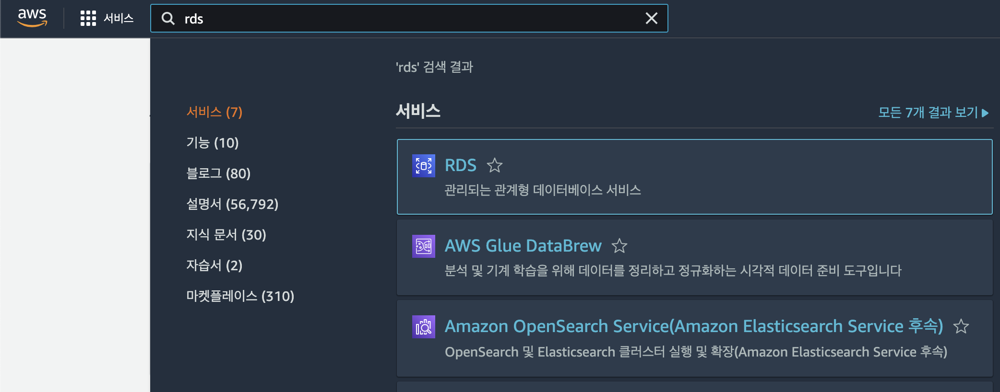


2. [ 데이터베이스 생성 ] 클릭
   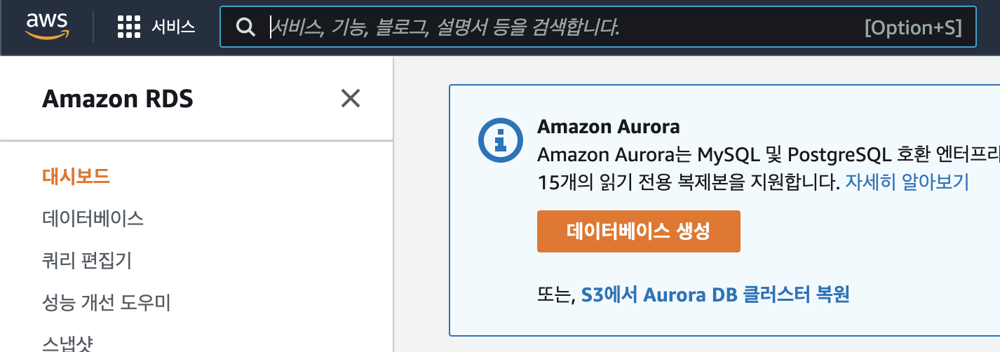


3. RDS 생성
    1. MariaDB / 사용사례 선택
        - MariaDB
            - 무료이기도 하고, Amazon Aurora와 호환되어 교체가 쉽다.
        - 사용사례
            - 프리티어로 이용하기 때문에 `[프리티어]` 선택

   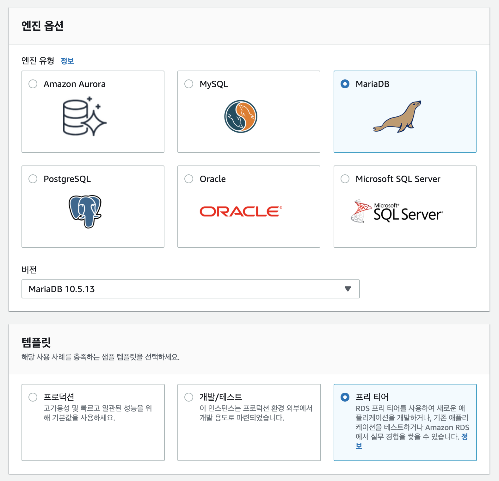

    2. DB 인스턴스와 마스터 사용자 정보 등록
        - 본인만의 DB 인스턴스명과 사용자 정보 등록
        - 등록한 정보로 DB 접속을 하기때문에 메모해두기

   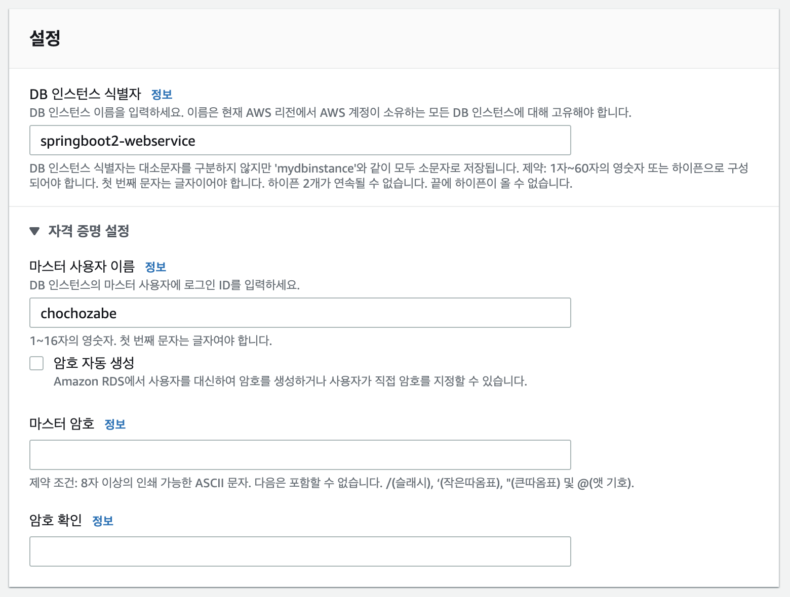

    3. 퍼블릭 액세스
        - 추후에 지정된 IP만 접근할 수 있도록 수정

   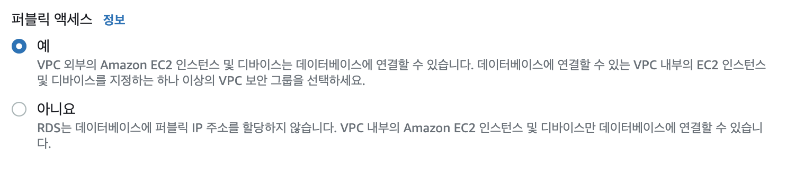

    4. 데이터베이스 옵션

   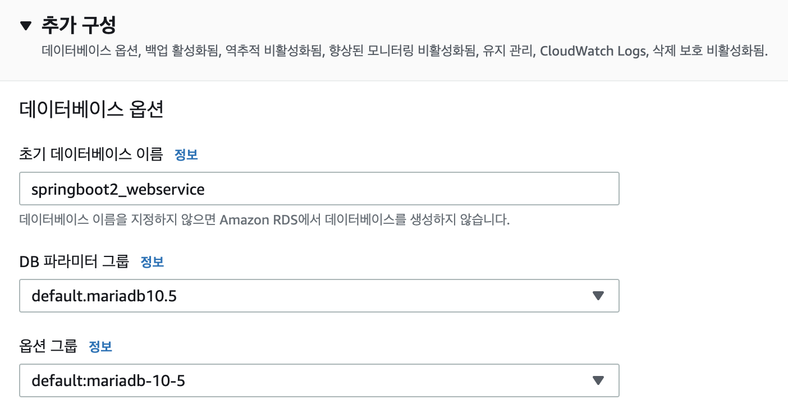


5. 완료 후 DB 인스턴스 세부 정보 확인
    - **상태가 생성 중 혹은 사용가능**이면 성공

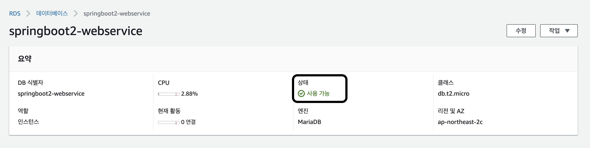

<br>

#### RDS 운영환경에 맞는 파라미터 설정하기

1. 좌측 카테고리에서 `[ 파라미터 그룹 ]` 이동

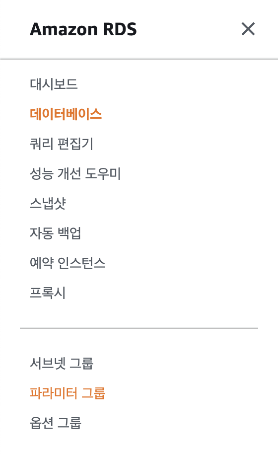

2. `[ 파라미터 그룹 생성 ]`

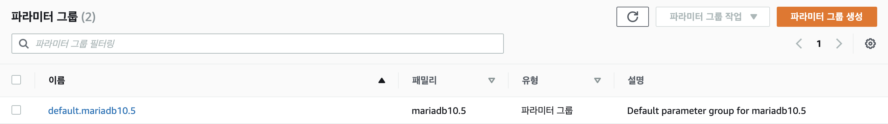

3. 파라미터 그룹 세부 정보
    - MariaDB의 버전을 생성한 MariaDB 버전과 맞춰주고 그룹 이름 기재


4. 생성한 파라미터 그룹으로 이동한 후 `[ 파라미터 편집 ]`


5. 파라미터 편집
    1. time_zone : `[ Asia/Seoul ]`
    2. Character Set
        1. character 항목 : `utfmb4`
        2. collation 항목 : `utfmb4_general_ci`
    3. max_connections : `150`
    4. `[ 변경 사항 저장 ]`


6. 생성한 파라미터 그룹 RDS 연결
    - 좌측 카테고리에서 `[ 데이터베이스 ]` 이동
    - 추가 구성 > 데이터베이스 옵션 > DB 파라미터 그룹 수정
    - 저장 후 `[ 즉시 적용 ]`으로 반영


<br>

#### 내 PC에서 RDS 접속해보기

**RDS 접속**

1. RDS의 보안 그룹에 내 IP 추가
    - RDS의 세부정보 페이지에서 `[ 보안 그룹 ]` 클릭
      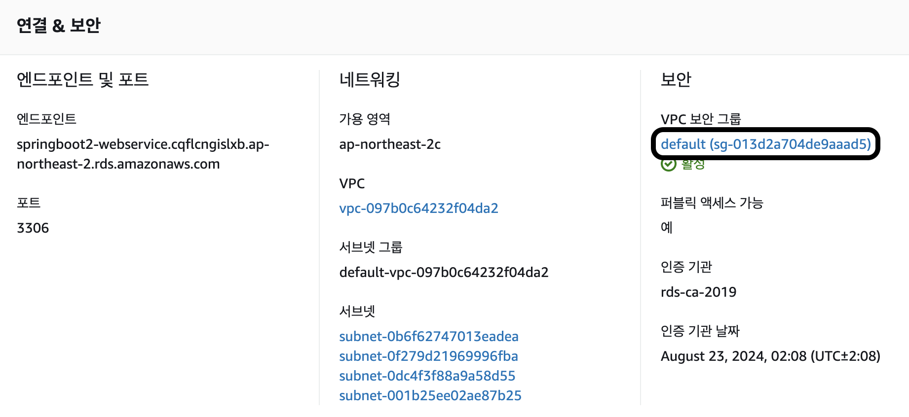
    - 현재 브라우저는 그대로 두고 새 브라우저를 열어 EC2에 사용된 보안그룹의 그룹 ID 복사
      
    - 복사된 보안 그룹 ID와 내 IP를 **RDS 보안그룹의 인바운드**로 추가
        - 인바운드 규칙 유형에서는 MYSQL/Aurora 선택 (포트 자동)
        - EC2 보안그룹을 추가하면 EC2와 RDS 간에 접근 가능

      


2. 엔드포인트 확인
    - 엔드포인트 : 접근가능한 URL
   
      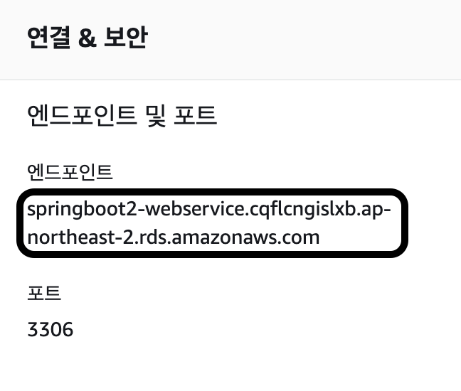


3. Database 플러그인 실행

   


4. MariaDB 추가 및 RDS 접속정보 입력

   


5. 연결

> 책은 MYSQL로 생성하고 있지만 나의 경우는 MYSQL로 생성하면 에러가 나서 MariaDB로 생성

<br>

**DB 테스트**

- console 생성

  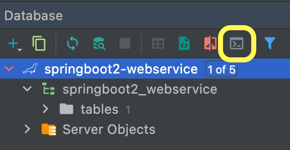


- character_set, collation 설정 확인
   ```mariadb
   show variables like '%c'
   ```
    - 결과를 보면 character_set_database, collation_connection 두 가지만 utf8mb4가 아닌 latin1로 되어있다
    - 이 항목은 RDS 파라미터 그룹으로는 변경이 안되기때문에 직접 변경
      ```mariadb
      ALTER DATABASE [데이터베이스 명]
      CHARACTER SET = "utf8mb4"
      COLLATE = "utf8mb4_general_ci"
      ```
    - 쿼리 적용 후 변경사항 확인
      


- 타임존 확인

```mariadb
select @@time_zone, now()
```
결과 
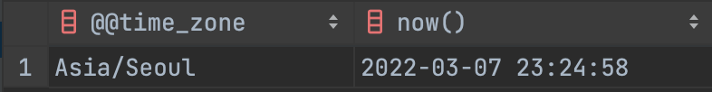


- 한글 저장 테스트
  - 추후 변경된 설정값이 자동으로 적용되지 않기때문에 **테이블 생성은 모든 설정(인코딩 등)이 모두 끝난 후 생성**
```mariadb
create table test (
  id bigint(20) not null auto_increment,
  content varchar(255) default null,
  primary key (id)
) engine = InnoDB;

insert into test(content) values ('테스트');

select * from test;
```
결과


<br>

#### EC2에서 RDS 접근 확인

1. EC2 접속
```shell
ssh [서비스 명]
```


2. Mysql cli 설치
```shell
sudo yum install mysql
```


3. RDS 접속
```shell
mysql -u [계정] -p -h [HOST 주소]
```
- 패스워드를 입력하라는 메세지가 나오면 패스워드를 입력


4. 실제로 생성한 RDS가 맞는지 확인
```shell
show databases;
```
- 기존에 생성한 데이터베이스가 있어야함


